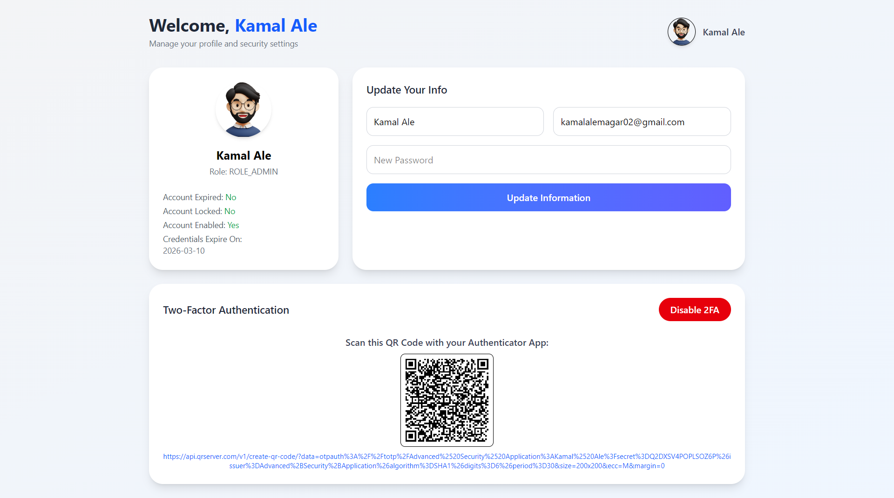

# 🛡️ Advanced Security System

A full-stack authentication and authorization system using **React** and **Tailwind CSS** on the frontend, and **Spring Boot** on the backend. Features include:

- JWT Authentication
- Role-Based Access Control (RBAC)
- Two-Factor Authentication (2FA)
- Forgot/Reset Password
- Token Expiration Handling

---

## 🚀 Tech Stack

### Frontend
- React
- React Router
- Tailwind CSS
- Axios
- jwt-decode

### Backend
- Spring Boot
- Spring Security
- JWT
- Hibernate + JPA
- MySQL

---

## ✨ Features

- ✅ Secure Login / Register / Logout
- 🔐 JWT Token with Expiration Check
- 🔄 Refresh Token Logic (Optional)
- 🔑 Two-Factor Authentication (via OTP)
- 📧 Forgot / Reset Password via Email
- 👮 Role-based Access (Admin/User)
- ⚡ SPA with React Router
- 🌈 Beautiful UI with Tailwind CSS

---

## 📸 Screenshots

### 🏠 Dashboard / Profile Page

---

